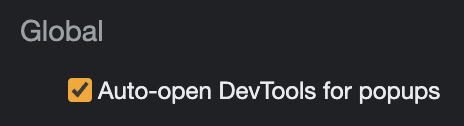
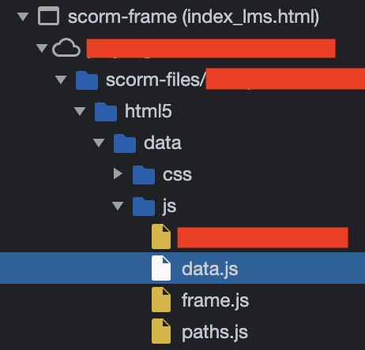

# Reverse engineering SCORM courses

## Disclaimer

The content in this document is purely for educational purposes. I am not liable
under any circumstance for how this document is leveraged.

## Intro

Many online courses are built in LMS systems that use [SCORM] - Sharable Content
Object Reference Model - standards for course data and LMS action sequencing.
[GLS] - Global Learning Systems - is one example of a platform that fits this
bill. The rest of this document outlines a (fairly rudimentary) procedure for
understanding how quiz answers and correctness are encoded in applications like
GLS. I'm not an expert in SCORM or LMS's and have only observed and learned
things from the "outside" (i.e. browser dev tools), so it would not be
surprising if the procedure doesn't match exactly for every LMS application out
there.

## Procedure

1. Ensure "Auto-open DevTools for popups" is enabled in the global settings of
   the browser's dev tools
   
1. Open DevTools on the LMS page that the available modules
1. Open any module (this should also pop open a DevTools instance for the module
   popup)
1. In the DevTools instances for the module, navigate to the Sources
1. Navigate to the `scorm-files/html5`/js` folder
   
1. Select the `data.js` file
   This file should look something like:
   ```js
   window.globalProvideData('data', /* big JSON doc embedded as a string */);
   ```
1. Copy the contents out to a text editor
1. From the text editor, copy the JSON doc string portion only (i.e. exclude the
   `window.globalProvideData('data', )` prefix and the `);` suffix)
1. Back in DevTools, navigate to the Console tab
1. At the console, parse the JSON doc via `JSON.parse(<paste-string-here>);`
1. Right-click the console-formatted, parsed JSON object and select "Copy
   object".
1. Paste this object back in your text editor (and enable JSON syntax
   highlighting if you want)
1. Navigate to a question in the LMS module (this procedure assumes multiple
   choice-style questions)
1. Search for some substring from any of the choices in your text editor
1. You should see that specific choice in a `"choices"` array that's in an
   object with `"kind": "interaction"`:
   ```json
   {
     "kind": "interaction",
     "id": "<some-unique-ID>",
     "choices": [
       {
         "kind": "choice",
         "id": "choice_<some-unique-ID>",
         "lmstext": "The specific text of choice 1"
       },
       {
         "kind": "choice",
         "id": "choice_<some-unique-ID>",
         "lmstext": "The specific text of choice 2"
       },
       {
         "kind": "choice",
         "id": "choice_<some-unique-ID>",
         "lmstext": "The specific text of choice 3"
       },
       {
         "kind": "choice",
         "id": "choice_<some-unique-ID>",
         "lmstext": "The specific text of choice 3"
       }
     ]
   }
   ```
1. Now that we've found the right interaction, we can search by the
   interaction's `"id"` field that is a sibling field to `"choices"` (see
   above). It is recommended to search in reverse from where you are currently
   in the JSON doc, as the interaction answers are generally at towards the
   bottom of the doc.
1. This should put the search nested somewhere inside an `"answers"` object,
   where each object under `"answers"` has `"kind": "answer"`.
1. Scan through the `"answers"` object until you find an object with both
   `"kind": "answer"` and `"status": "correct"`.
   * If the question is multiple-choice/multiple-select, there should be an
     `"evaluate"` object with the choice IDs of the correct choices:
   ```json
   {
     "kind": "answer",
     "id": "<some-unique-ID>",
     "points": 10,
     "status": "correct",
     "evaluate": {
       "statements": [
         {
           "kind": "equals",
           "choiceid": "choices.choice_<some-unique-ID>",
           "ignorecase": false
         },
         {
           "kind": "equals",
           "choiceid": "choices.choice_<some-unique-ID>",
           "ignorecase": false
         },
         {
           "kind": "equals",
           "choiceid": "choices.choice_<some-unique-ID>",
           "ignorecase": false
         }
       ]
     },
     "actions": [
       {
         "kind": "if_action",
         "condition": {
           "statement": {
             "kind": "compare",
             "operator": "lte",
             "valuea": "<some-unique-ID>.$AttemptCount",
             "typea": "property",
             "valueb": 1,
             "typeb": "number"
           }
         },
         "thenActions": [
           {
             "kind": "show_slidelayer",
             "hideOthers": "oncomplete",
             "transition": "appear",
             "objRef": {
               "type": "string",
               "value": "<some-unique-ID>"
             }
           },
           {
             "kind": "exe_actiongroup",
             "id": "DisableChoices_<some-unique-ID>"
           }
         ]
       }
     ]
   }
   ```
   * If the question is multiple-choice/single-select, the JSON object will look
     the same as above, but `"statements"` will just have a single choice in the
     array.
   * In either case, now simply search for each choice ID to get back to the
     interaction object where you can see the choice text for the specific
     choice ID.

[SCORM]: https://scorm.com/
[GLS]: https://globallearningsystems.com/
